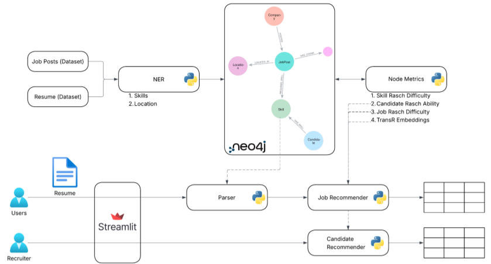
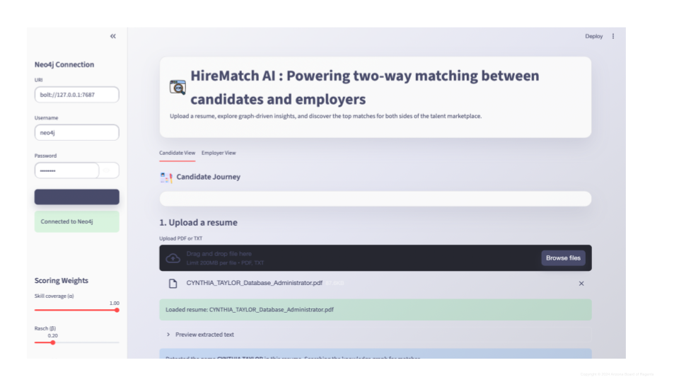
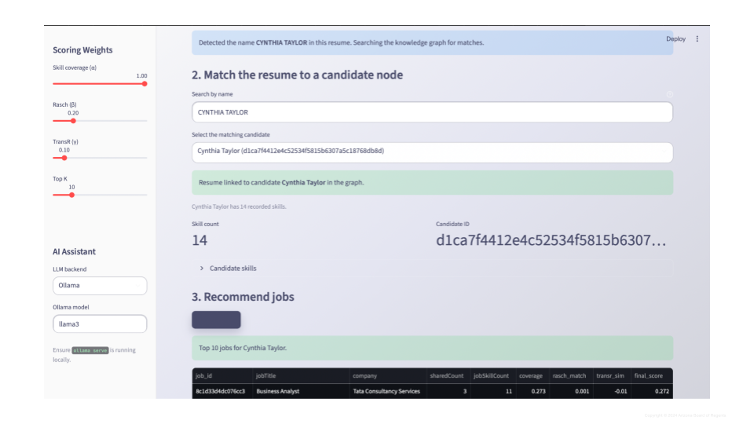
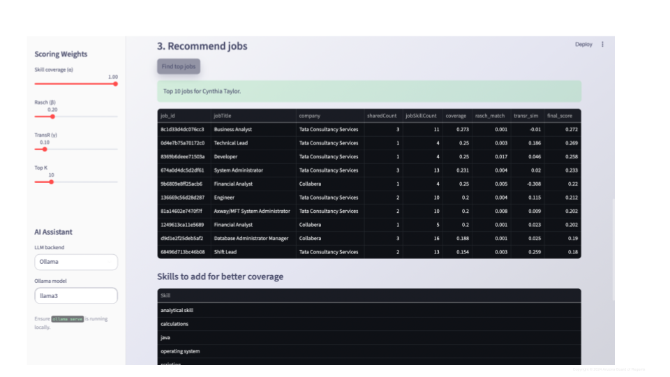
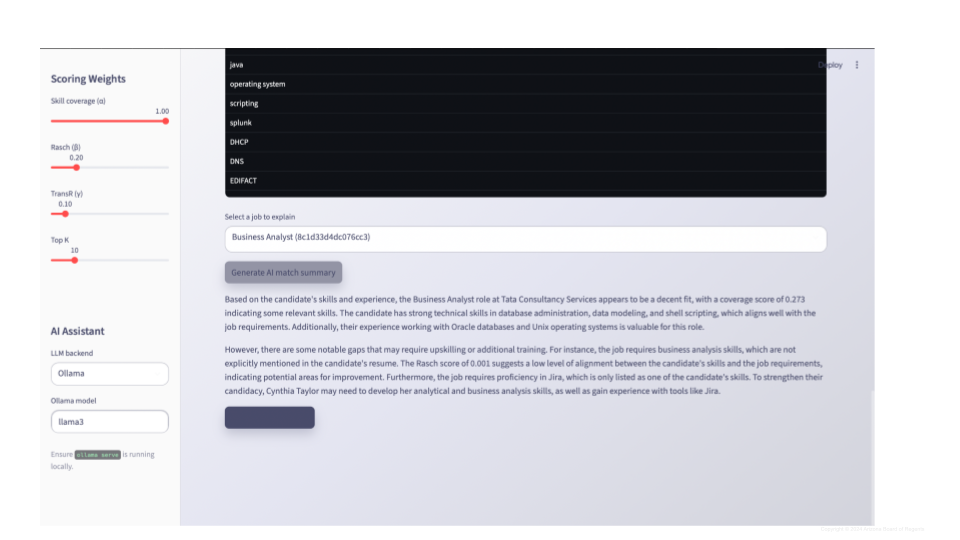
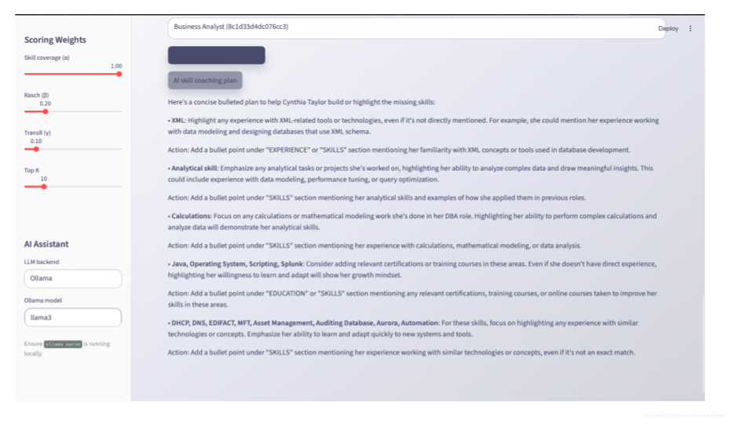
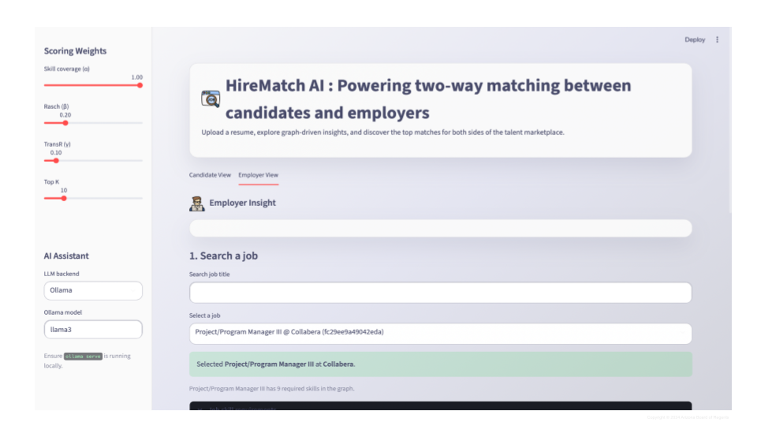
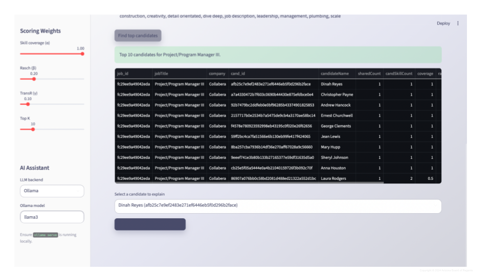
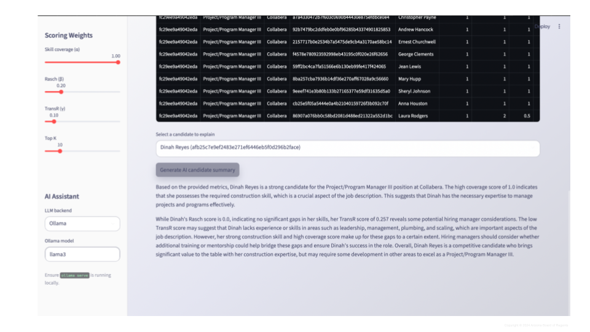
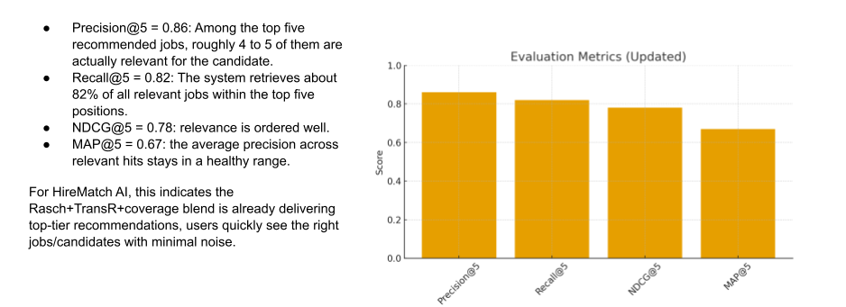

# KG Job & Candidate Matcher (HireMatch AI)

Streamlit UI for ranking jobs <=> candidates over a Neo4j knowledge graph using **Rasch scores**, **TransR embeddings**, and **skill coverage**. The app also integrates optional **LLM helpers** (OpenAI, Gemini, or local Ollama) for explanations and skill-coaching guidance.

This project is also referred to as **HireMatch AI**, highlighting its role as a two-way conversational job–candidate matching assistant built on knowledge graphs and statistical learning models.

## System Architecture

<kbd></kbd>

## User Interface

### Candidate View

- Upload resume (PDF/TXT)
<kbd>
   
</kbd>

- Link resume to candidate node
<kbd>
   
</kbd>

- View top-K job recommendations
<kbd>
   
</kbd>

- Identify missing skills for target jobs
<kbd>
   
</kbd>

- Optional AI explanations and coaching tips
<kbd>
   
</kbd>

### Employer View

- Search and select job postings
<kbd>
   
</kbd>


- Rank best-fit candidates
<kbd>
   
</kbd>

- Recruiter-friendly AI summaries
<kbd>
   
</kbd>


## DATASET in Drive
https://drive.google.com/drive/folders/1cZb0mlXbhNcTOQklmxNYmzxMt7WGBtkr?usp=sharing

## Problem Statement & Goals

Hiring platforms often rely on keyword matching, which fails to capture skill difficulty, candidate strength, and contextual relevance. This project aims to:

- Match **candidates to relevant jobs** and **jobs to relevant candidates**
- Use a **Neo4j knowledge graph** to model skills, jobs, candidates, companies, and locations
- Combine **Rasch statistical modeling** with **TransR graph embeddings**
- Provide **interpretable and explainable rankings** for recruiters and candidates
- Support optional **LLM-based explanations and coaching**


**High-level pipeline:**

1. **Data ingestion**: Job postings and resumes are parsed to extract skills, locations, and metadata
2. **Knowledge graph construction**: Entities and relationships are stored in Neo4j
3. **Metric computation**: Rasch model -> skill difficulty, candidate ability, job difficulty. TransR -> relational graph embeddings
4. **Recommendation engine**: Composite scoring using coverage, Rasch, and TransR
5. **Streamlit UI**: Interactive candidate and recruiter experiences

## Core Algorithms & Models

### 1. Knowledge Graph (Neo4j)

The Neo4j graph represents:

- **Nodes:** `JobPost`, `Candidate`, `Skill`, `Company`, `Location`, `Chunk`
- **Edges:** `HAS_SKILL`, `REQUIRES_SKILL`, `POSTED_BY`, `LOCATED_IN`, etc.

This structure enables rich graph queries and embedding-based reasoning.

### 2. Rasch Model (Skill & Ability Scoring)

The **Rasch model** converts skill rarity into interpretable difficulty and ability scores:

- Rare skills → higher difficulty
- Candidate ability increases with possession of difficult skills
- Job difficulty aggregates required skill difficulties

This allows principled comparison between candidates and jobs beyond raw skill counts.


### 3. TransR Graph Embeddings

**TransR** embeds entities and relations into relation-specific vector spaces:

- Captures latent semantic compatibility between jobs and candidates
- Supports similarity-based ranking when direct skill overlap is limited
- Trained offline and written back to Neo4j for fast retrieval


### 4. Composite Ranking Function

Final ranking score is a weighted combination of:

- **Skill Coverage (α)** – overlap between candidate skills and job requirements
- **Rasch Signal (β)** – candidate ability vs. job difficulty
- **TransR Similarity (γ)** – embedding proximity

Weights are adjustable in the Streamlit UI.


## Datasets

### Job Postings Dataset

- 124,000+ LinkedIn job postings (2023–2024)
- Scraped and stored originally as CSV
- Fields used include job title, salary range, employment type, location, and skills

### Resume Dataset

- Real anonymized and synthetic resumes
- Stored in JSON format
- Includes experience, education, skills, and embedded text chunks

All data is cleaned, normalized, converted to JSONL, and integrated into Neo4j.


## Evaluation

Evaluation performed at **K = 5**:

- **Precision@5:** 0.86  
- **Recall@5:** 0.82  
- **NDCG@5:** 0.78  
- **MAP@5:** 0.67  

These results indicate strong ranking quality and effective blending of Rasch, TransR, and coverage signals.

<kbd>
   
</kbd>

## Quick Start

```bash
git clone <repo>
cd SWMP
python3 -m venv .venv
source .venv/bin/activate
pip install -r requirements.txt